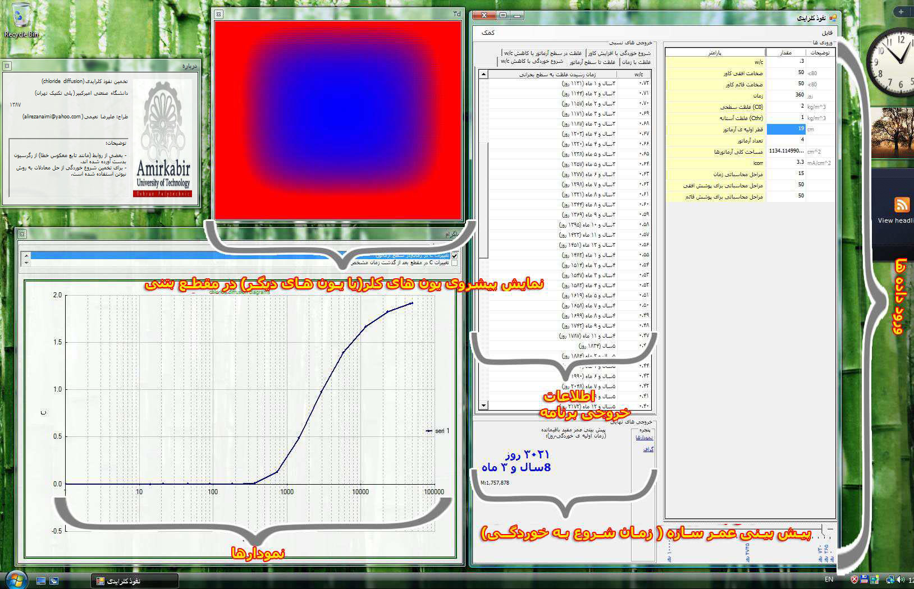

  [//]: # "https://github.com/alinaimi/Durability-of-concrete-structures"

<!---
todo:
add codes
cleanup
-->

# Durability of Concrete Structures
An application to estimate chloride diffusion and the durability of concrete structures. It can give an estimate of potential life span of a concrete element/structure.
This program was developed to provide a basement to estimate and determine the age of a concrete element, that can be expanded to whole structure. Currently available only in Persian language.

Screen Shots
=============

